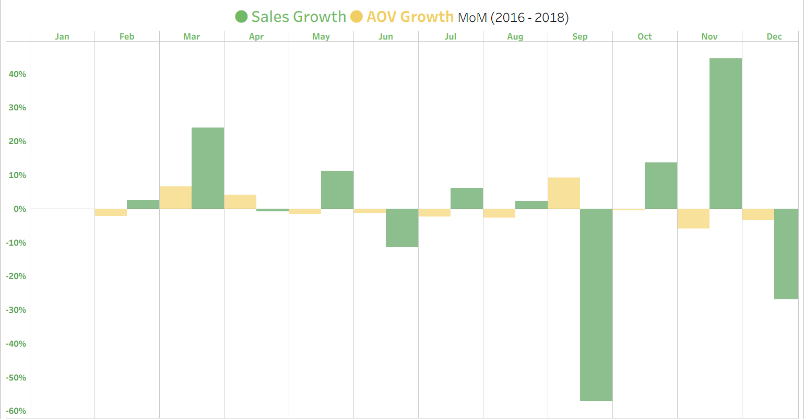

<table>
  <tr>
    <td></td>
    <td><h1>Olist E-Commerce Analytics</h1></td>
  </tr>
</table>
 
 

<h2 align="center">Project Background</h2>

Olist is a Brazilian retail technology startup founded in 2015 that connects small retailers and major brands to online marketplaces, simplifying store management, logistics, and financial operations. In December 2021, Olist reached unicorn status with a valuation exceeding $1 billion, alongside expanding into financial services such as credit solutions and receivables anticipation for merchants.

In this project, I partner with the Head of Operations to analyze data, extract insights, and deliver actionable recommendations to improve performance across sales, product, and marketing teams.

<h4>North Star Metrics</h4>
<ul>
  <li><strong>Sales Trends:</strong> Focusing on key metrics — revenue, order volume, and AOV — while analyzing trends over time to identify seasonality, peak periods, and overall growth.</li>
  <li><strong>Product Performance:</strong> Analyzing product categories based on sales, revenue, and customer ratings to identify top and underperforming segments.</li>
  <li><strong>Customer Loyalty:</strong> Segmenting customers into loyal and non-loyal groups to assess retention, repeat purchase behavior, and revenue contribution.</li>
  <li><strong>Logistics & Customer Satisfaction:</strong> Examining delivery performance and review scores to understand the impact of shipping delays on customer satisfaction.</li>
</ul>
 

  

 

<h2 align="center">Executive Summary</h2>

Olist's growth is driven primarily by increasing order volume rather than higher customer spend, with revenue rising <strong>22.1% YoY</strong> alongside a <strong>21.6% increase in orders</strong>, while AOV remains stable (~R$145–R$175). However, performance is highly concentrated — <strong>62% of revenue</strong> comes from SP, RJ, and MG, and <strong>50% is driven by just seven product categories</strong>. At the same time, customer retention remains a key gap: repeat customers make up only <strong>3% of the base</strong> but generate <strong>5.6% of revenue</strong>, indicating strong upside in loyalty-driven growth. From an operational perspective, delivery performance is a critical issue, with <strong>8% late orders</strong> significantly impacting customer satisfaction, as reflected in <strong>65% of negative reviews</strong> linked to delays.

 

  

