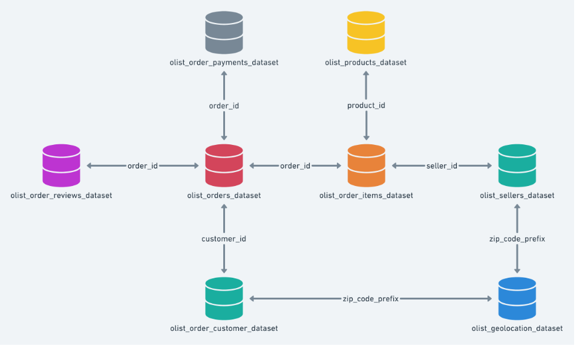
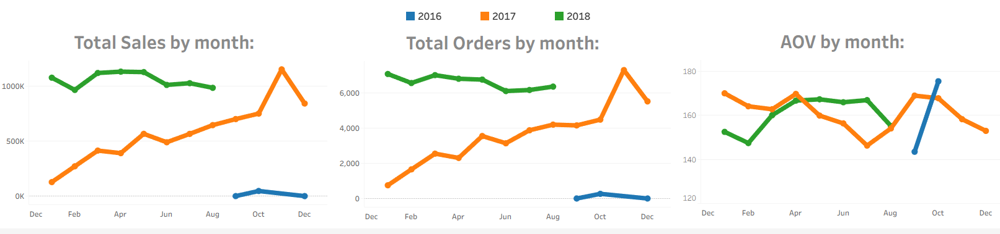
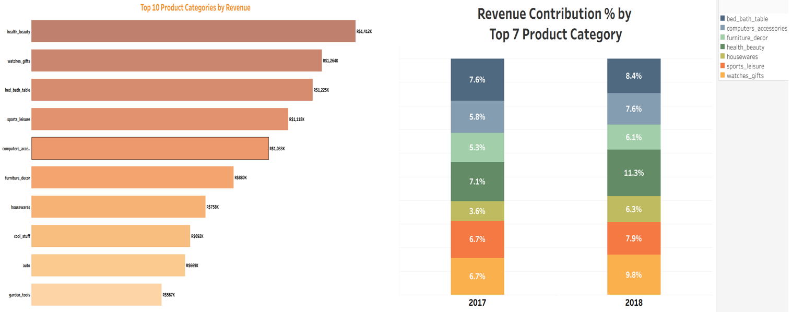
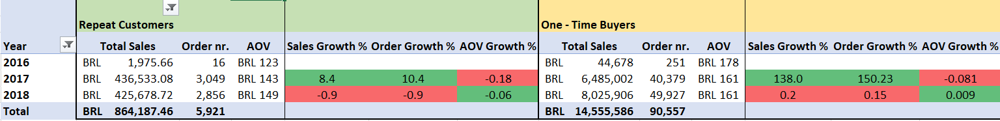
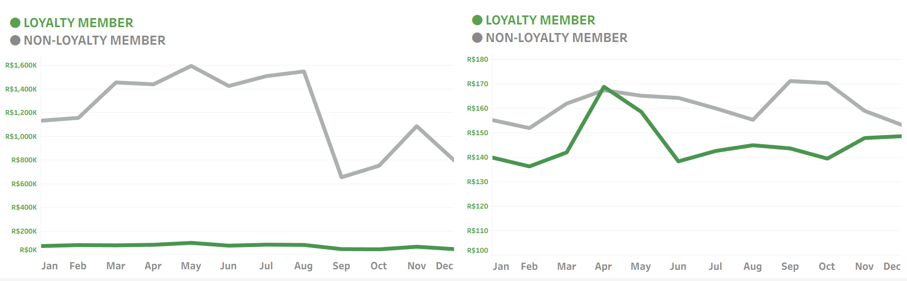
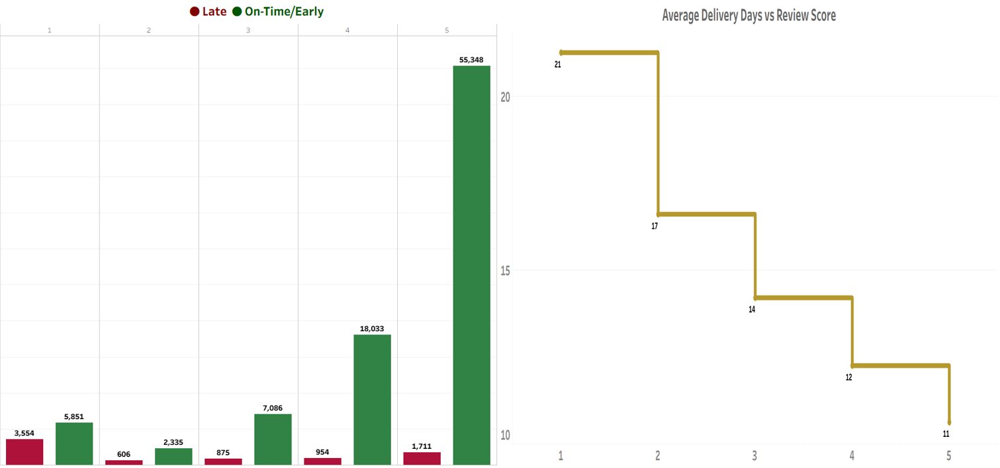

  
  &nbsp;&nbsp;&nbsp;&nbsp;
  <h1 align="center">Olist E-Commerce Report</h1>

 

<h2 align="center">Project Background</h2>

Olist is a Brazilian retail technology startup founded in 2015 that connects small retailers and major brands to online marketplaces, simplifying store management, logistics, and financial operations. In December 2021, Olist reached unicorn status with a valuation exceeding $1 billion, alongside expanding into financial services such as credit solutions and receivables anticipation for merchants.

In this project, I partner with the Head of Operations to analyze data, extract insights, and deliver actionable recommendations to improve performance across sales, product, and marketing teams.

<h4>North Star Metrics</h4>
<ul>
  <li><strong>Sales Trends:</strong> Focusing on key metrics — revenue, order volume, and AOV — while analyzing trends over time to identify seasonality, peak periods, and overall growth.</li>
  <li><strong>Product Performance:</strong> Analyzing product categories based on sales, revenue, and customer ratings to identify top and underperforming segments.</li>
  <li><strong>Customer Loyalty:</strong> Segmenting customers into loyal and non-loyal groups to assess retention, repeat purchase behavior, and revenue contribution.</li>
  <li><strong>Logistics & Customer Satisfaction:</strong> Examining delivery performance and review scores to understand the impact of shipping delays on customer satisfaction.</li>
</ul>
 

  

 

<h2 align="center">Executive Summary</h2>

Olist's growth is driven primarily by increasing order volume rather than higher customer spend, with revenue rising <strong>22.1% YoY</strong> alongside a <strong>21.6% increase in orders</strong>, while AOV remains stable (~R$145–R$175). However, performance is highly concentrated — <strong>62% of revenue</strong> comes from SP, RJ, and MG, and <strong>50% is driven by just seven product categories</strong>. At the same time, customer retention remains a key gap: repeat customers make up only <strong>3% of the base</strong> but generate <strong>5.6% of revenue</strong>, indicating strong upside in loyalty-driven growth. From an operational perspective, delivery performance is a critical issue, with <strong>8% late orders</strong> significantly impacting customer satisfaction, as reflected in <strong>65% of negative reviews</strong> linked to delays.

  

 

<h2 align="center">Insights Deep Dive: Sales Trend</h2>

  
  

 
<ul>
  <li>Sales are highly concentrated in key regions, with São Paulo (SP), Rio de Janeiro (RJ), and Minas Gerais (MG) contributing 62% of total revenue. São Paulo alone accounts for 37%, highlighting a strong geographic dependency.</li>
  <li>Olist’s sales follow a clear seasonal trend, with significant peaks in November and December driven by holiday demand, and noticeable declines in February and October during off-peak periods.</li>
  <li>Total sales grew by 22.1%, increasing from 6.9M in 2017 to 8.4M in 2018, closely aligned with a 21.6% rise in order volume (43K to 52K), indicating that growth was primarily driven by increased transaction volume rather than changes in customer spend, despite 2018 being a partial year (through August).</li>
  <li>Total revenue increased steadily from Q3 2016 through Q2 2018, achieving its highest level in Q2 2018, before experiencing a decline in Q3 2018.</li>
  <li>Average Order Value remains relatively stable, fluctuating between approximately R$145 and R$175, with minor seasonal variations. This stability indicates that revenue growth is primarily driven by increased order volume rather than changes in customer spending behavior.</li>
</ul>
 
<h2 align="center">Product Performance</h2>

  
  

 
<ul>
  <li>Seven product categories—Health & Beauty, Watches & Gifts, Bed & Table, Sports & Leisure, Computers & Accessories, Furniture & Décor, and Housewares—collectively account for 50% of total revenue.</li>
  <li>Despite having the highest AOV at R$1,290 the Computers category represents just 1.5% of total revenue with 177 Total Order nr.</li>
  <li>The Health & Beauty category leads in revenue, contributing R$1.4 million, which represents 9% of total sales.</li>
  <li>Compact Fixed Telephony 16x16cm-F129E4 (R$ 13,664) and Professional Housewares 61x33cm-4CCE7F (R$ 6,929) are biggest contributors to AOV.</li>
</ul>
 
<h2 align="center">Customers Loyalty Program</h2>

  
  

 
<ul>
  <li>Repeat customers (≥2 orders) account for just 3% of the customer base, yet contribute 5.6% of total revenue (R$864,357), demonstrating their outsized value relative to one-time buyers.</li>
  <li>Although the number of loyal customers remained relatively stable (1,170 in 2017 vs. 1,086 in 2018), their share of the total customer base declined from 2.78% to 2.10%, indicating that growth was driven largely by one-time buyers rather than sustained customer relationships.</li>
  <li>Unique customers grew by approximately 22% year-over-year, rising from 42,136 to 51,612, signaling a substantial increase in platform reach and new user inflow.</li>
  <li>AOV for loyal customers increased from R$143 in 2017 to R$149 in 2018. Although loyal customers contribute a higher share of total revenue relative to 	their size, their lower AOV suggests that value is driven by purchase frequency rather than transaction size.</li>
   <li>The loyalty program shows strong performance in states São Paulo (SP), Rio de Janeiro (RJ), and Minas Gerais (MG), while other states exhibit greater 	variability, indicating an opportunity for more targeted, region-specific retention strategies.</li>
</ul>
 
<h2 align="center">Logistics & Customer Satisfaction</h2>

    

 
<ul>
  <li>Out of all orders, 8% (7,700 orders) were delivered later than the estimated date. The concentration of delays in cities such as Armação dos Búzios (46%), Santarém (34%), and Santa Inês (33%) suggests uneven logistics performance and potential bottlenecks in specific geographic areas.</li>
  <li>Low-rated reviews (≤3) represent 23% of total customer feedback, and notably, 65% of these are linked to late deliveries. The average score within this group is 2.5, indicating that delays are a key driver of dissatisfaction.</li>
  <li>From an operational perspective, seller-driven delays account for 6.64% of orders, slightly higher than carrier-driven delays at 5.91%.  Additionally, 2.21% of deliveries are impacted by failures on both ends, indicating an opportunity to improve coordination across the fulfillment network.</li>
  <li>Product categories with the highest share of low ratings (≤3) include Office Furniture (39%), Home Comfort (32%), and Audio (31%).</li>
  <li>The cancellation rate stands at a low 0.63%, reflecting stable operations. Despite this, canceled orders correspond to approximately R$143K in associated revenue, highlighting a measurable financial effect.</li>
  <li>The number of active sellers on Olist has grown significantly over time. In 2016, there were 139 sellers with 298 orders. This increased to 1,766 sellers and 44,375 orders in 2017, and further to 2,354 sellers with 53,531 orders in 2018.</li>
</ul>
 
<h2 align="center">Recommendations</h2>

<h3 align="left">Sales & Trends:</h3>
 
<ul>
  <li><strong>Prioritize High-Performing Regions:</strong> With 62% of revenue concentrated in SP, RJ, and MG (SP at 37%), Olist should intensify targeted acquisition, offer seller incentives (fee discounts, logistics subsidies), and partner with local logistics providers to strengthen delivery reliability and sustain regional dominance.</li>
  <li><strong>Maximize Q4 Peak Performance (Nov–Dec):</strong> With a disproportionate share of revenue generated in November–December, Olist should increase marketing and inventory by 20–30% ahead of Q4, expand Black Friday and bundle promotions, and scale logistics capacity to ensure timely delivery during peak demand.</li>
  <li><strong>Mitigate Off-Peak Declines (Feb & Oct):</strong> Sales drop notably in February and October. Olist should introduce seasonal promotions, flash sales, and discount campaigns during these months. Launch targeted remarketing campaigns to re-engage existing customers.</li>
  <li><strong>Drive Growth Through Order Volume Expansion:</strong> Revenue growth (+22.1%) is primarily driven by order volume (+21.6%), with AOV stable at R$145–R$175. Olist should prioritize customer acquisition and retention over pricing changes, and introduce free shipping thresholds slightly above AOV (~R$160–R$180) to increase basket size.</li>
</ul>
 
<h3 align="left">Product Performance:</h3>
 
<ul>
  <li><strong>Double Down on High-Contribution Categories:</strong> Seven categories generate 50% of total revenue, led by Health & Beauty at R$1.4M (9%). Olist should prioritize inventory, promotions, and ad spend in these segments, expand assortment to capture additional demand, and drive growth through cross-sell/upsell strategies (e.g., bundles) and repeat purchase incentives such as subscriptions and targeted discounts.</li>
  <li><strong>Unlock High-AOV Category Potential (Computers):</strong> With the highest AOV (R$1,290) but only 1.5% of revenue (177 orders), the Computers category shows strong value but low volume. Olist should boost visibility through targeted ads and homepage placement, and introduce installment options to reduce purchase barriers and increase conversion.</li>
</ul>
 
<h3 align="left">Customer loyalty learning:</h3>
 
<ul>
  <li><strong>Scale Repeat Customer Base (High-Value Segment):</strong> Repeat customers represent only 3% of users but contribute 5.6% of revenue (R$864K), showing strong value. Actions recommended: launch a structured loyalty program (points, rewards, exclusive offers). Offer discounts on second purchase to convert first-time buyers.</li>
  <li><strong>Shift Growth from Acquisition to Retention:</strong> Customer base grew +22% YoY, but loyalty share declined (2.78% → 2.10%), indicating weak retention. Balance marketing spend by allocating 20–30% toward retention campaigns. Use personalized recommendations based on browsing and purchase history.</li>
  <li><strong>Optimize Onboarding to Convert New Users Faster:</strong> With 51K+ unique customers, growth is driven primarily by first-time buyers with low retention. Olist should implement a first-30-day engagement strategy (welcome offers, personalized recommendations) and optimize the early user experience, including a simplified checkout, to reduce churn and improve retention.</li>
</ul>
 
<h3 align="left">Transportation & Customer Satisfaction:</h3>
 
<ul>
  <li><strong>Reduce Late Deliveries to Improve Customer Satisfaction:</strong> Low-rated reviews (23% of total) are heavily driven by delays, with 65% linked to late deliveries and an average score of 2.5. Actions recommended: improve delivery time accuracy (better ETA predictions). Send proactive delay notifications and compensation (credits/discounts).</li>
  <li><strong>Target High-Delay Regions to Improve Delivery Reliability:</strong> Late deliveries affect 8% of orders (7.7K), with extreme concentrations in cities like Armação dos Búzios (46%), Santarém (34%), and Santa Inês (33%). Prioritize logistics audits and carrier performance reviews in high-delay cities and introduce regional carrier diversification to reduce dependency on underperforming providers.</li>
  <li><strong>Address Seller-Side Bottlenecks (Primary Delay Driver):</strong> Seller-driven delays (6.64%) slightly exceed carrier delays (5.91%), with 2.21% impacted by both. Actions recommended: implement seller performance scoring with penalties for repeated delays. Offer fulfillment support services (e.g., warehousing, faster dispatch options).</li>
  <li><strong>Improve Quality in Low-Rated Product Categories:</strong> Categories like Office Furniture (39%), Home Comfort (32%), and Audio (31%) show the highest share of poor ratings. Olist should audit product quality, packaging, and supplier reliability in these categories. Also should remove or flag consistently underperforming sellers/products.</li>
</ul>
 
<h2>Tools & Stack used:</h2>

  
  
  

<h2>Data Source:</h2>

  

Brazilian E-Commerce Public Dataset by Olist — 100k orders from 2016 to 2018 across multiple marketplaces in Brazil, including order status, price, payment, freight, customer location, product attributes, and customer reviews.

<h2>Author</h2>

  

